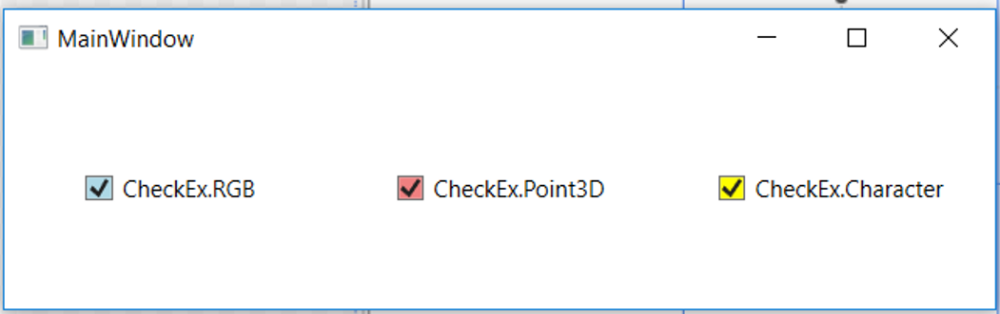
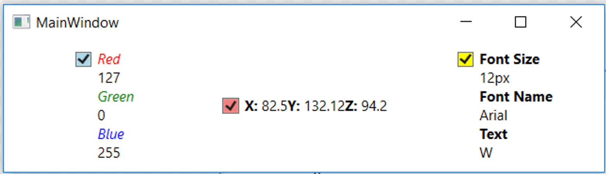

# Module 02 - Template - exercise

## Exercise - Templates
### Introduction
In this exercise we will practice using Templates in WPF. We will practice both `Control Templates` and `Data Templates` Specifically we will pracice:
1. Creating Data Templates
2. Defining the templeted type
3. Building the template and binding to the data context
4. Creating control template
5. Defining the target type
6. Using (binding to) the control properties
7. Responding to visual states

### Steps
1. Define 3 classes
    * `RGB` with Properties: `Red`, `Green`, `Blue` of type `byte`
    * `Point3D` with Properties: `X`, `Y`, `Z` of type `double`
    * `Character` with Properties: `FontSize`, `FontName`, `Text` of type string
2. Create the following window
    * In the main area, divide the area into 3 columns
    * Place a check box in each column
    * Make sure each checkbox has a different background
    * Define the content of each check box to one of the objects - `RGB`, `Point3D` or `Character`

3. Create Data Template for each type of content
    * Make sure each data template presents all the data
    * Make sure each data template looks different

4. Change the looks of the check box
    * Instead of a check mark next to the content, surround it with a red circle
    * Make sure the background of the circle is the background of the check box
    * Make sure to display the content
    * Make sure the red circle disappears when the check box is off
